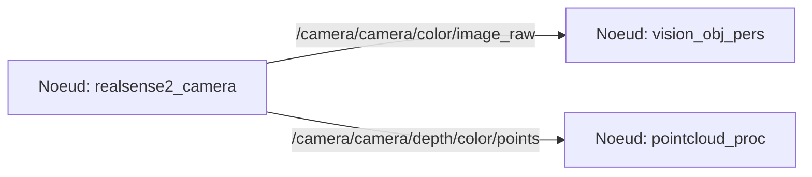

# Projet robotique

## Sujet 3 - Brique vision

Tanguy FROUIN 5IRC

1. État de l'Art

Sources:  

- Point clouds  
https://developer.nvidia.com/blog/detecting-objects-in-point-clouds-using-ros-2-and-tao-pointpillars/  
https://www.stereolabs.com/docs/ros2/depth-sensing/  
https://github.com/IntelRealSense/librealsense/tree/development/wrappers/python/examples  
https://github.com/jamohile/stereoscopic-point-clouds  
https://github.com/heremaps/pptk  
https://github.com/strawlab/python-pcl  
https://github.com/ros-perception/perception_pcl  
https://index.ros.org/p/pcl_ros/#humble  
https://academy.visualcomponents.com/lessons/import-point-cloud-with-python-api/  
https://www.youtube.com/watch?v=HIRj5pH2t-Y  
https://jeffzzq.medium.com/ros2-image-pipeline-tutorial-3b18903e7329  
https://medium.com/@regis.loeb/playing-with-point-clouds-for-3d-object-detection-eff1d98e526a  
https://medium.com/yodayoda/from-depth-map-to-point-cloud-7473721d3f  
http://www.diva-portal.org/smash/get/diva2:1245296/FULLTEXT01.pdf  
http://www.open3d.org/docs/release/tutorial/geometry/rgbd_image.html  
http://www.open3d.org/docs/release/tutorial/geometry/pointcloud.html  
https://towardsdatascience.com/how-to-use-pointnet-for-3d-computer-vision-in-an-industrial-context-3568ba37327e  

- Segmentation  
https://docs.opencv.org/4.8.0/d1/d5c/tutorial_py_kmeans_opencv.html  
https://thepythoncode.com/article/kmeans-for-image-segmentation-opencv-python  
https://sites.google.com/view/aide-python/applications/traitements-et-analyses-dimages/k-means-sur-image-avec-opencv-pour-segmenter  
https://www.kdnuggets.com/2019/08/introduction-image-segmentation-k-means-clustering.html  
https://dev.to/andreygermanov/how-to-implement-instance-segmentation-using-yolov8-neural-network-3if9  


- Mediapipe  
https://github.com/google/mediapipe/blob/master/docs/solutions/  
https://github.com/googlesamples/mediapipe/tree/main/examples  
https://developers.google.com/mediapipe/solutions/guide  

- OpenPose  
https://github.com/CMU-Perceptual-Computing-Lab/openpose  
https://cmu-perceptual-computing-lab.github.io/openpose/web/html/doc/md_doc_00_index.html  
https://github.com/ZheC/tf-pose-estimation  
https://github.com/Daniil-Osokin/lightweight-human-pose-estimation.pytorch  
https://github.com/firephinx/openpose_ros  
https://github.com/ravijo/ros_openpose  

- Ultralytics  
https://github.com/ultralytics/ultralytics/issues/2028  
https://docs.ultralytics.com/  
  
- Intel RealSense  
https://github.com/IntelRealSense/librealsense  
https://github.com/IntelRealSense/realsense-ros  
https://dev.intelrealsense.com/docs/python2  
https://www.intelrealsense.com/developers/  

- NumPy sur GPU (CuPy)  
https://cupy.dev/  


2. Liste des fonctionnalités
a. [x] test
b. [ ] test2
    1. [ ] Sub-task 1
    2. [x] Sub-task 2


3. Représentation des noeuds ROS2


4. Description de l'algo


5. Technologies et outils potentiels

    - ROS2 : Intégration et communication
    - Python : API et algorithmes
    - OpenCV : Traitement d'image et visualisation côté utilisateur
    - YOLOv8 : Reconnaissance d'objets, personnes
    - Rviz : visualisation des topics côté ROS2  
  
6. Pré-requis
- Environnement de dev  
  - Ubuntu 22.04  
  - ROS2 Humble  
  - Python 3.10  
  - numpy 1.26.2  
  - ultralytics 8.0.227  
  - opencv-python 4.8.0.74  

7. Installation

- Installer les librairies
```bash
pip install -r requirements.txt
```

- Connaitre la version de CUDA  (plusieurs façons)
```bash
nvcc --version
cat /usr/local/cuda/version.json
ls -l /usr/local | grep cuda # cuda supposément installé dans /usr/local/cuda

```

- Installer la version de CuPy (NumPy sur GPU) selon la version de CUDA
```bash
# For CUDA 10.2
pip install cupy-cuda102

# For CUDA 11.0
pip install cupy-cuda110

# For CUDA 11.1
pip install cupy-cuda111

# For CUDA 11.2 ~ 11.x
pip install cupy-cuda11x

# For CUDA 12.x
pip install cupy-cuda12x

# For AMD ROCm 4.3
pip install cupy-rocm-4-3

# For AMD ROCm 5.0
pip install cupy-rocm-5-0
```

- Installer le SDK d'Intel® RealSense™
```bash
sudo apt install ros-humble-librealsense2*
```

- Création du workspace ROS2 Humble
```bash
mkdir -p ~/ros2_humble_ws/src
cd ~/ros2_humble_ws/src/
```

- Installer le wrapper Intel® RealSense™ ROS2
Clone dans `src`:
```bash
git clone https://github.com/IntelRealSense/realsense-ros.git -b ros2-development
cd ~/ros2_humble_ws
```

- Installer les dépendences
```bash
sudo apt-get install python3-rosdep -y
sudo rosdep init
rosdep update
rosdep install -i --from-path src --rosdistro humble --skip-keys=librealsense2 -y
```
Normalement si toutes les dépendances sont installées le terminal affiche:
```
#All required rosdeps installed successfully
```

Toujours dans le workspace humble, build et source:
```bash
colcon build
source install/setup.bash
```

- Si le build ne passe pas (selon mon historique de commandes):

```bash
source install/setup.bash
colcon build
source install/setup.bash 
colcon build
rosdep install -i --from-path src --rosdistro humble -y
sudo apt-get update
rosdep install -i --from-path src --rosdistro humble -y
colcon build
source /opt/ros/humble/setup.bash 
source install/setup.bash 
colcon build
source /opt/ros/humble/setup.bash 
source install/setup.bash
```

- Placer le package `ROS2/robovision_ros` dans `ros2_humble_ws/src/`
Build et source
```bash
colcon build
source install/setup.bash
```

- Lancer le noeud de la camera dans un terminal
```bash
ros2 launch realsense2_camera rs_launch.py pointcloud.enable:=true align_depth.enable:=true pointcloud.ordered_pc:=true
```

- Lancer les noeuds du package dans un autre terminal
```bash
ros2 launch robovision_ros launch.py
```

- Lancer Rviz dans un autre terminal
```bash
rviz2
```