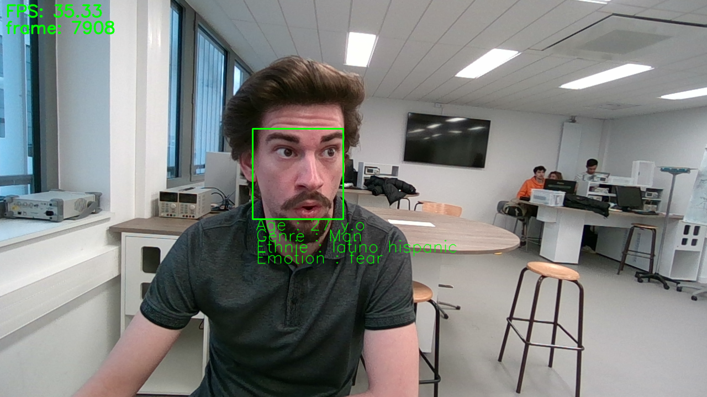
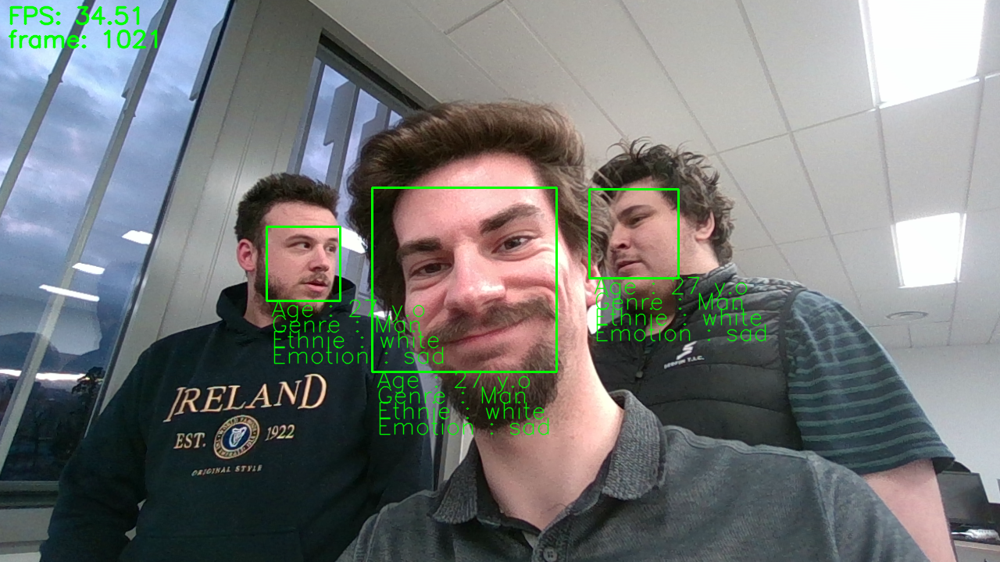

# Projet robotique

## Sujet 3 - Brique vision

Auteur : Tanguy FROUIN 5IRC

# État de l'Art

## "Awesome lists"
- [Une liste d'articles et d'ensembles de données sur l'analyse des nuages de points (traitement)](https://github.com/Yochengliu/awesome-point-cloud-analysis)
- [Une collection de projets publics impressionnants de détection d'objets YOLO](https://github.com/codingonion/awesome-yolo-object-detection)
- [Articles, codes et ensembles de données sur l'apprentissage profond pour la détection d'objets en 3D](https://github.com/TianhaoFu/Awesome-3D-Object-Detection)

## Point Clouds
- [NVIDIA Developer Blog sur les nuages de points et ROS 2](https://developer.nvidia.com/blog/detecting-objects-in-point-clouds-using-ros-2-and-tao-pointpillars/)
- [Stereolabs - Depth Sensing avec ROS2](https://www.stereolabs.com/docs/ros2/depth-sensing/)
- [Exemples Python pour Intel RealSense](https://github.com/IntelRealSense/librealsense/tree/development/wrappers/python/examples)
- [Traitement de nuages de points stéréoscopiques](https://github.com/jamohile/stereoscopic-point-clouds)
- [PPTK - Python Point Processing Toolkit](https://github.com/heremaps/pptk)
- [Python-PCL (Point Cloud Library)](https://github.com/strawlab/python-pcl)
- [Perception PCL sur ROS](https://github.com/ros-perception/perception_pcl)
- [PCL ROS sur ROS Humble](https://index.ros.org/p/pcl_ros/#humble)
- [Importation de nuages de points avec Python API](https://academy.visualcomponents.com/lessons/import-point-cloud-with-python-api/)
- [Vidéo YouTube sur la classification de nuages de points 3D - PointNet](https://www.youtube.com/watch?v=HIRj5pH2t-Y)
- [Tutoriel sur la pipeline d'image ROS2](https://jeffzzq.medium.com/ros2-image-pipeline-tutorial-3b18903e7329)
- [Traitement de nuages de points pour la détection d'objets 3D](https://medium.com/@regis.loeb/playing-with-point-clouds-for-3d-object-detection-eff1d98e526a)
- [De la carte de profondeur au nuage de points](https://medium.com/yodayoda/from-depth-map-to-point-cloud-7473721d3f)
- [Thèse sur la perception d'objets YOLO 3D](http://www.diva-portal.org/smash/get/diva2:1245296/FULLTEXT01.pdf)
- [Open3D pour les images RGBD](http://www.open3d.org/docs/release/tutorial/geometry/rgbd_image.html)
- [Open3D pour les nuages de points](http://www.open3d.org/docs/release/tutorial/geometry/pointcloud.html)
- [Utilisation de PointNet pour la vision par ordinateur 3D](https://towardsdatascience.com/how-to-use-pointnet-for-3d-computer-vision-in-an-industrial-context-3568ba37327e)

## Segmentation
- [Documentation OpenCV K-Means pour la segmentation d'images](https://docs.opencv.org/4.8.0/d1/d5c/tutorial_py_kmeans_opencv.html)
- [Article K-Means pour la segmentation d'images avec OpenCV en Python](https://thepythoncode.com/article/kmeans-for-image-segmentation-opencv-python)
- [Site Google K-Means sur image avec OpenCV](https://sites.google.com/view/aide-python/applications/traitements-et-analyses-dimages/k-means-sur-image-avec-opencv-pour-segmenter)
- [Introduction à la segmentation d'images avec K-Means](https://www.kdnuggets.com/2019/08/introduction-image-segmentation-k-means-clustering.html)
- [Implémentation de la segmentation d'instance avec YOLOv8](https://dev.to/andreygermanov/how-to-implement-instance-segmentation-using-yolov8-neural-network-3if9)

## Mediapipe
- [Solutions Mediapipe de Google](https://github.com/google/mediapipe/blob/master/docs/solutions/)
- [Exemples Mediapipe de Google](https://github.com/googlesamples/mediapipe/tree/main/examples)
- [Guide des solutions Mediapipe](https://developers.google.com/mediapipe/solutions/guide)

## OpenPose
- [OpenPose par CMU Perceptual Computing Lab](https://github.com/CMU-Perceptual-Computing-Lab/openpose)
- [Documentation OpenPose](https://cmu-perceptual-computing-lab.github.io/openpose/web/html/doc/md_doc_00_index.html)
- [Estimation de pose avec TensorFlow](https://github.com/ZheC/tf-pose-estimation)
- [Estimation de pose lightweight avec PyTorch](https://github.com/Daniil-Osokin/lightweight-human-pose-estimation.pytorch)
- [OpenPose avec ROS par Firephinx](https://github.com/firephinx/openpose_ros)
- [ROS OpenPose par Ravijo](https://github.com/ravijo/ros_openpose)

## Ultralytics
- [Issues Ultralytics sur GitHub](https://github.com/ultralytics/ultralytics/issues/2028)
- [Documentation Ultralytics](https://docs.ultralytics.com/)

## Intel RealSense
- [Librealsense par Intel](https://github.com/IntelRealSense/librealsense)
- [RealSense ROS par Intel](https://github.com/IntelRealSense/realsense-ros)
- [Documentation Python pour Intel RealSense](https://dev.intelrealsense.com/docs/python2)
- [Ressources pour développeurs Intel RealSense](https://www.intelrealsense.com/developers/)

## Optimisation
- [CuPy - NumPy-like API pour GPU](https://cupy.dev/)


# Liste des fonctionnalités  

- Noeud `pointcloud_proc` :  
    - [x] Récupération du nuage de points 3D depuis la caméra
    - [x] Projection des points 3D en 2D sur l'image RGB
    - [x] Création d'une image de profondeur
        - [x] Publication données brutes sur le topic `/robovision/depth/raw`
        - [x] Publication visualisation sur le topic `/robovision/depth/color`
- Noeud `vision_obj_pers` :  
    - [x] Récupération de l'image RGB et de l'image de profondeur
    - [x] Correction de la distortion de l'image RGB
    - [x] Inférence du modèle de segmentation YOLOv8 :
        - [x] Traitement pour chaque objet détecté
            - [x] Affichage des bounding boxes et informations de l'objet
            - [x] Calcul et affichage de la distance objet-caméra
            - [x] Projection des pixels (centre bbox) dans le monde réel en mètres
            - [x] Publication des TFs (x,y,z)
    - [x] Inférence du modèle de pose de YOLOv8 :
        - [x] Analyse des positions des personnes (assis, debout, couché)
        - [x] Affichage du squelette et de la position dans la bounding box
    - [x] Superposition des images "seg_frame" et "pose_frame"
- Noeud `face_reco_analysis` : 
    - [x] Détection des visages
    - [x] Détection des attributs (age, genre, émotion, ethnie)


# Représentation des noeuds ROS2


# Description de l'algo


La caméra envoie le nuage de points 3D :  

<p align="center"><em>Visualisation du pointcloud envoyé par la caméra</em></p>


Projection des points 3D du nuage en 2D à l'aides des intrinsèques et extrinsèques de la caméra :  

<p align="center"><em>Visualisation des points 3D projetés en 2D sur l'image RGB</em></p>


Après le calcul de projection, on crée l'image de profondeur qui sera publiée et utilisée pour les calculs de distance :  

<p align="center"><em>Visualisation de l'image de profondeur brut</em></p>


Création de la même image mais en RGB, qui sera elle aussi publiée :  

<p align="center"><em>Visualisation de l'image de profondeur RGB</em></p>


Le calcul de la profondeur est basé sur les pixels des masques de segmentation des objets. On fait ensuite la médiane de la profondeur des points 3D correspondant à ces pixels. Voici par exemple les masques affichés :  

<p align="center"><em>Visualisation détection et segmentation objets, distance, pose et position personne</em></p>


Par soucis de performance, on n'affiche pas les masques de segmentation.  
Voici l'image finale :  

<p align="center"><em>Visualisation détection objets, distance, pose et position personne</em></p>


On récupère le centre des bounding boxes des objets/personnes (x,y en pixels) puis le pixel est projeté dans le référentiel du monde réel en mètre à l'aide des intrinsèques et extrinsèques de la caméra pour ensuite publier le TF correspondant (x,y,z; z étant la distance calculée précédemment) :  


<p align="center"><em>Visualisation des TFs</em></p>





Pour voir les performances de l'algo :  
```bash
nvidia-smi
```
Ressources utilisées :
 - 170 MiB pour `pointcloud_proc` 
 - 650 MiB pour `vision_obj_pers`
 - 6260 MiB pour `face_reco_analysis`
  
```bash
+---------------------------------------------------------------------------------------+
| NVIDIA-SMI 535.146.02             Driver Version: 535.146.02   CUDA Version: 12.2     |
|-----------------------------------------+----------------------+----------------------+
| GPU  Name                 Persistence-M | Bus-Id        Disp.A | Volatile Uncorr. ECC |
| Fan  Temp   Perf          Pwr:Usage/Cap |         Memory-Usage | GPU-Util  Compute M. |
|                                         |                      |               MIG M. |
|=========================================+======================+======================|
|   0  NVIDIA GeForce RTX 2070 ...    Off | 00000000:01:00.0 Off |                  N/A |
| N/A   75C    P0              80W /  80W |   7094MiB /  8192MiB |     56%      Default |
|                                         |                      |                  N/A |
+-----------------------------------------+----------------------+----------------------+
                                                                                         
+---------------------------------------------------------------------------------------+
| Processes:                                                                            |
|  GPU   GI   CI        PID   Type   Process name                            GPU Memory |
|        ID   ID                                                             Usage      |
|=======================================================================================|
|    0   N/A  N/A      2146      G   /usr/lib/xorg/Xorg                            4MiB |
|    0   N/A  N/A    314080      C   /usr/bin/python3                            172MiB |
|    0   N/A  N/A    314082      C   /usr/bin/python3                            654MiB |
|    0   N/A  N/A    314084      C   /usr/bin/python3                           6260MiB |
+---------------------------------------------------------------------------------------+

```
<p align="center"><em>Performances</em></p>

## Les maths derrière

### Transformation 2D en 3D

Matrice intrinsèque caméra RGB :  

$ 
\text{CameraMatrix} =
\begin{bmatrix} 
fx & 0  & cx \\
0  & fy & cy \\
0  & 0  & 1
\end{bmatrix}
$

Dans cette matrice :

- $fx$ : longueur focale horizontale (px)
- $fy$ : longueur focale verticale (px)
- $cx$ : coordonnée horizontale du point principal (centre optique) (px)
- $cy$ : coordonnée verticale du point principal (centre optique) (px)

Cette matrice est utilisée pour effectuer la transformation des coordonnées 3D du monde réel en coordonnées 2D sur le plan de l'image de la caméra.

Point 2D $[x,y]$ en point 3D $[X, Y, Z]$ :  
  
$X = (x - c_x) * d / fx$  
$Y = (y - c_y) * d / fy$  
$Z = d$  
  
Appliquer les transformations extrinsèques aux points 3D calculés :  

Matrice de Rotation et Vecteur de Translation : représentent la transformation entre les systèmes de coordonnées de la caméra de profondeur et de la caméra RGB.  

Transformation des Points 3D : Chaque point 3D calculé doit être transformé en utilisant $R$ et $T$. Pour un point 3D $[X,Y,Z]$, la transformation se fait comme suit :  
  
$  
\begin{bmatrix}
X' \\ Y' \\ Z'
\end{bmatrix}
= R \times
\begin{bmatrix}
X \\ Y \\ Z
\end{bmatrix}
+
T
$  

Où X′, Y′, et Z′ sont les coordonnées transformées dans le système de coordonnées du monde réel.

### Transformation 3D en 2D

Pour chaque point 3D $[X, Y, Z]$ dans le nuage de points :

Appliquer les extrinsèques (rotation et translation) :
  
$   
\begin{bmatrix}
X' \\ Y' \\ Z'
\end{bmatrix}
= R \times
\begin{bmatrix}
X \\ Y \\ Z
\end{bmatrix}
+
T
$  
  
Ajouter une colonne de 1 pour obtenir les [coordonnées homogènes](https://fr.wikipedia.org/wiki/Coordonn%C3%A9es_homog%C3%A8nes) :
  
$  
\begin{bmatrix}
X' \\ Y' \\ Z' \\ 1
\end{bmatrix}
$  

Effectuer la multiplication matricielle avec la matrice intrinsèque de la caméra :
  
$  
\begin{bmatrix}
u \\ v
\end{bmatrix}
= \text{CameraMatrix} \times
\begin{bmatrix}
X' \\
Y' \\
Z' \\
1
\end{bmatrix}
$  

Normaliser pour obtenir les coordonnées en pixels u et v en divisant par la composante $Z'$ :
   
$
\begin{bmatrix}
u' \\
v'
\end{bmatrix}
= \begin{bmatrix}
u \\
v
\end{bmatrix}
/
Z'
$


# Technologies et outils

  - ROS2 : Intégration et communication
  - Python : API et algorithmes
  - OpenCV : Traitement d'image et visualisation côté utilisateur
  - YOLOv8 : Reconnaissance et segmentation d'objets, personnes
  - Rviz : visualisation des topics côté ROS2  
  
# Pré-requis  
Environnement de dev :  
  - Ubuntu 22.04  
  - Nvidia RTX 2070 Super
  - ROS2 Humble  
  - Python 3.10  
  - numpy 1.26.2  
  - ultralytics 8.0.227  
  - opencv-python 4.8.0.74  
  - CUDA 12.1  

# Installation

1) Installer ROS2 Humble

1) Installer les librairies
```bash
pip install -r requirements.txt
```

2) Connaitre la version de CUDA  (plusieurs façons)
```bash
nvcc --version
cat /usr/local/cuda/version.json
ls -l /usr/local | grep cuda # cuda supposément installé dans /usr/local/cuda
```

3) Installer la version de CuPy (NumPy sur GPU) selon la version de CUDA (ne pas remplacer x dans la version de CuPy)
```bash
# Pour CUDA 10.2
pip install cupy-cuda102

# Pour CUDA 11.0
pip install cupy-cuda110

# Pour CUDA 11.1
pip install cupy-cuda111

# Pour CUDA 11.2 ~ 11.x
pip install cupy-cuda11x

# Pour CUDA 12.x
pip install cupy-cuda12x

# Pour AMD ROCm 4.3
pip install cupy-rocm-4-3

# Pour AMD ROCm 5.0
pip install cupy-rocm-5-0
```

1) Installer dlib compilé avec CUDA
- Vérifier la version de nvcc
```bash
nvcc --version
```

- Installer dlib

```bash
pip uninstall dlib
# cloner le repo (dans /home par exemple)
git clone https://github.com/davisking/dlib.git
cd dlib
mkdir build
cd build


cmake .. -DDLIB_USE_CUDA=1 -DUSE_AVX_INSTRUCTIONS=1
cmake --build .

cd ..
python3 setup.py install


```
Si problème de compatibilité entre le compilateur (gcc/g++) et nvcc (le compilateur CUDA), chercher le compilateur compatible:  
[Tableau compatibilité nvcc et gcc](https://gist.github.com/ax3l/9489132)  
  
Installer la version spécifique de gcc et g++ (ex pour ver 9):
```bash
sudo apt update
sudo apt install gcc-9 g++-9
```
Préciser la version lors du build
```bash
pip uninstall dlib
cd dlib
mkdir build
cd build

CC=gcc-9 CXX=g++-9 cmake .. -DDLIB_USE_CUDA=1 -DUSE_AVX_INSTRUCTIONS=1
cmake --build .

cd ..
CC=gcc-9 CXX=g++-9 python3 setup.py install
```


1) Installer le SDK d'Intel® RealSense™
```bash
sudo apt install ros-humble-librealsense2*
```

1) Création du workspace ROS2 Humble
```bash
mkdir -p ~/ros2_humble_ws/src
cd ~/ros2_humble_ws/src/
```

1) Installer le wrapper Intel® RealSense™ ROS2
Clone dans `src`:
```bash
git clone https://github.com/IntelRealSense/realsense-ros.git -b ros2-development
cd ~/ros2_humble_ws
```

1) Installer les dépendences
```bash
sudo apt-get install python3-rosdep -y
sudo rosdep init
rosdep update
rosdep install -i --from-path src --rosdistro humble --skip-keys=librealsense2 -y
```
Normalement si toutes les dépendances sont installées le terminal affiche:
```
#All required rosdeps installed successfully
```

Toujours dans le workspace humble, build et source:
```bash
colcon build
source install/setup.bash
```

7) (bis) Si le build ne passe pas (selon mon historique de commandes):

```bash
source install/setup.bash
colcon build
source install/setup.bash 
colcon build
rosdep install -i --from-path src --rosdistro humble -y
sudo apt-get update
rosdep install -i --from-path src --rosdistro humble -y
colcon build
source /opt/ros/humble/setup.bash 
source install/setup.bash 
colcon build
source /opt/ros/humble/setup.bash 
source install/setup.bash
```

8) Placer le package `ROS2/robovision_ros` dans `ros2_humble_ws/src/`
Build et source
```bash
colcon build
source install/setup.bash
```

9) Lancer le noeud de la camera dans un terminal
```bash
ros2 launch realsense2_camera rs_launch.py pointcloud.enable:=true align_depth.enable:=true pointcloud.ordered_pc:=true
```

10) Lancer les noeuds du package dans un autre terminal
```bash
ros2 launch robovision_ros launch.py
```

11) Lancer Rviz dans un autre terminal
```bash
rviz2
```